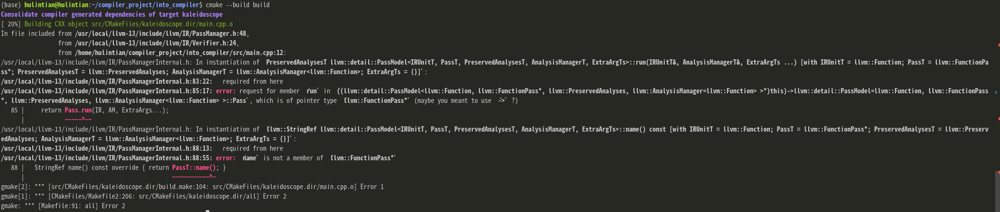
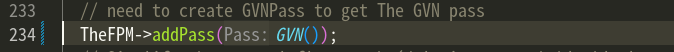

# Kaleidoscope

## Lexer

### Tokens
* EOF
* def
* extern
* identifier
* number

### Get tokens
* 遇到空格跳过
* 使用两个静态变量存值
  * IdentifierStr ： 
  * NumVal

## Abstract Syntax Tree
* ExprAST
  * NumberExprAST
  * VariableExprAST
  * BinaryExprAST
  * CallExprAST
* PrototypeAST
* FunctionAST

##  Parser

## Code Generatotr

### Binary Operator
1. Recursively emit code for the left-hand side of the expression ,then the right-hand side , then compute the result of the expresion.
2. specify what instruction to create according to the opcode
    * In  kaleidoscope there  is only one type **double**
    * LLVM instructions are constrained by strict rules:
        1. left-hand side and right-hand side must have the same type
        2. result type must match the oper  and types
3. For compare operator

* github path : <a> https://github.com/hulintian/into_compiler </a>
* refernece : <a> https://llvm.org/docs/tutorial/MyFirstLanguageFrontend/index.html </a>

## LLVM IR 的内存模型


## problem1


* 原因是llvm官方给的在FunctionAnalysisManager中添加GVNPass的方法变动了，应用下面这种方法添加GVNPass
、

## problem2
* 在编译过程中链接器报错
* 解决方法是在cmake中加上要链接的库
  ```cmake
  llvm_map_components_to_libnames(llvm_libs core orcjit native)
  ```