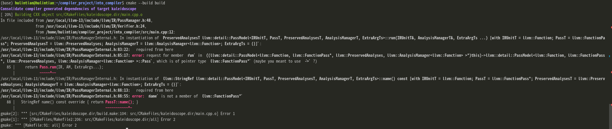
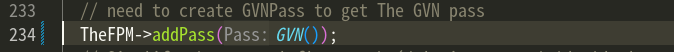

# Kaleidoscope

## Lexer

### Tokens
* EOF
* def
* extern
* identifier
* number

### Get tokens
* 遇到空格跳过
* 使用两个静态变量存值
  * IdentifierStr ： 
  * NumVal

## Abstract Syntax Tree
* ExprAST
  * NumberExprAST
  * VariableExprAST
  * BinaryExprAST
  * CallExprAST
* PrototypeAST
* FunctionAST

##  Parser

## Code Generatotr

### Binary Operator
1. Recursively emit code for the left-hand side of the expression ,then the right-hand side , then compute the result of the expresion.
2. specify what instruction to create according to the opcode
    * In  kaleidoscope there  is only one type **double**
    * LLVM instructions are constrained by strict rules:
        1. left-hand side and right-hand side must have the same type
        2. result type must match the oper  and types
3. For compare operator

* github path : <a> https://github.com/hulintian/into_compiler </a>
* refernece : <a> https://llvm.org/docs/tutorial/MyFirstLanguageFrontend/index.html </a>

## LLVM IR 的内存模型


## Use llvm 'opt' tool to generate CFG
```sh
llvm-as < t.ll | opt -passes=view-cfg
```


## problem1


* 原因是llvm官方给的在FunctionAnalysisManager中添加GVNPass的方法变动了，应用下面这种方法添加GVNPass
、

## problem2
* 在编译过程中链接器报错
* 解决方法是在cmake中加上要链接的库
  ```cmake
  llvm_map_components_to_libnames(llvm_libs core orcjit native)
  ```

## problem3
* llvm kaleidoscope中写的extern的函数在链接时并没有加入符号表里
  ```c++
  #define DLLEXPORT
  #endif

  /// putchard - putchar that takes a double and returns 0.
  extern "C" DLLEXPORT double putchard(double X) {
    fputc((char)X, stderr);
    return 0;
  }

  /// printd - printf that takes a double prints it as "%f\n", returning 0.
  extern "C" DLLEXPORT double printd(double X) {
    fprintf(stderr, "%f\n", X);
    return 0;
  }
  ```
  使用objdump -T 打印出可执行文件的符号表，里面并没有 *putchard* 和 *printd*
* 解决方法：
  * 在CMakeLists.txt中加上"-export-dynamic"，这样把主程序的所有符号都添加到符号表里了。
    ```CMakeLists.txt
    if(NOT LLVM_ENABLE_RTTI)
        set(CMAKE_CXX_FLAGS "${CMAKE_CXX_FLAGS} -fno-rtti -export-dynamic")
    endif()
    ```
  * 再查看符号表，表里有*putchard* 和 *printd*了。
